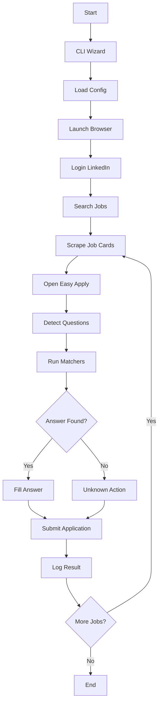
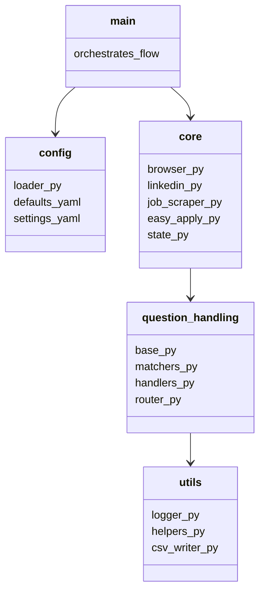

<h1 align="center">AutoJobApplier-LinkedIn</h1>

<p align="center">
  
  
  
  
  
</p>

Automate your LinkedIn **Easy Apply** workflow with intelligence, control, and extensibility.  

This tool streamlines job applications by automatically filling forms, answering questions using configurable defaults, and handling edge cases with a modular matcher system.


---


## [+] Index


- [Features](#-features)

- [Installation](#-installation)

- [Configuration](#-configuration)

- [Usage](#-usage)

- [Architecture & Workflow](#-architecture--workflow)

- [Extending the Q&A System](#-extending-the-qa-system)

- [Logging & Output Files](#-logging--output-files)

- [Future Upgrades](#-future-upgrades)

- [Contributing](#-contributing)

- [License](#-license)


---


## [+] Features


- Automated **LinkedIn Easy Apply**

- Smart **question answering system**

- Pluggable **matcher pipeline** (Keyword, Regex, Fuzzy, Faker)

- Pause on unknown questions (interactive CLI)

- Resume auto-upload

- CSV tracking (`applied_jobs.csv`, `failed_jobs.csv`)

- Stealth & headless browser support

- YAML-based configuration

- Extensible architecture for custom logic

- Rich CLI wizard (first-run setup)

- Pagination + blacklist filtering


---

## [+] Project Structure

<details>

<summary>[+] View Project Structure </summary>


```tree

auto_job_applier/
├── main.py                       # Entry point, interactive config, orchestration
├── requirements.txt
├── pyproject.toml (or setup.cfg)
├── config/
│   ├── __init__.py
│   ├── loader.py                 # Reads YAML/JSON, merges defaults, interactive overrides
│   ├── defaults.yaml             # Master default answers for ALL known question patterns
│   ├── settings.yaml             # Behaviour flags, search criteria, limits
│   └── user_data.yaml            # Generated after first-run wizard (credentials, resume path)
├── core/
│   ├── __init__.py
│   ├── browser.py                # Chrome session creation, profile options, stealth
│   ├── linkedin.py               # Login, navigation, filter setup
│   ├── job_scraper.py            # Extract job cards, details, pagination
│   ├── easy_apply.py             # Modal handling, question routing, final submission
│   └── state.py                  # Global state (counts, applied IDs, paused settings)
├── question_handling/
│   ├── __init__.py
│   ├── base.py                   # Abstract `QuestionHandler`, `AnswerMatcher`
│   ├── handlers.py               # Concrete handlers for each question type
│   ├── matchers.py               # Built‑in matchers (keyword, regex, fuzzy, default)
│   ├── router.py                 # Determines which matcher(s) to call for a question
│   └── custom_matchers/          # User‑added matchers (auto‑loaded)
│       └── __init__.py
├── utils/
│   ├── __init__.py
│   ├── logger.py                 # Python logging + Rich console handler
│   ├── csv_writer.py             # Thread‑safe CSV logging for applied/failed jobs
│   ├── helpers.py                # Element waits, scrolling, text input helpers
│   ├── faker_fill.py            # Generates plausible synthetic answers (if enabled)
│   └── exceptions.py            # Custom exceptions with recovery hints
├── data/
│   ├── applied_jobs.csv
│   ├── failed_jobs.csv
│   └── logs/                     # Rotating log files
├── resume/                       # Directory where the user’s resume is stored
│    └── (placeholder)
├── README.md
└── LICENSE.md

```

</details>


## [+] Installation


### 1. Clone Repository


```bash

git clone https://github.com/Kennny7/AutoJobApplier-LinkedIn.git

cd AutoJobApplier-LinkedIn

````

### 2. Create Virtual Environment


```bash

python -m venv venv

source venv/bin/activate   # Linux/macOS

venvScriptsactivate      # Windows

```

### 3. Install Dependencies


```bash

pip install -e .
# Using project.toml OR requirements.txt
pip install -r requirements.txt

```


<details>

<summary>[+] View requirements.txt</summary>


```txt

selenium

webdriver-manager

rich

questionary

pyyaml

faker

```

</details>


### 4. ChromeDriver Setup


* Uses `webdriver-manager` → auto-downloads correct driver

* Ensure Google Chrome is installed


---


## [+] Configuration


The system uses **two YAML files**:


### [+] `defaults.yaml`


* Defines **question → answer mappings**

* Supports placeholders like `%NAME%`, `%PHONE%`


### [+] `settings.yaml`


* Controls behavior:


* Headless mode

* Max applications

* Filters

* Unknown question handling


### [+] `user_data.yaml`


* Generated via **first-run wizard**

* Stores:


* Credentials

* Resume path

* Personal details


---


### [+] Key Settings


<details>

<summary>Important Configuration Options</summary>


| Option             | Description                                       |

| ------------------ | ------------------------------------------------- |

| `headless`         | Run browser without UI                            |

| `stealth`          | Reduce bot detection                              |

| `max_applications` | Limit per session                                 |

| `unknown_action`   | pause / skip_job / fill_placeholder / fill_random |

| `job_filters`      | Keywords, location, experience                    |

| `blacklist`        | Skip specific companies/jobs                      |


</details>


---


## ▶ Usage


### Run the Application


```bash

python main.py

```


### First Run Experience


* Interactive CLI wizard will ask:


* Resume path

* LinkedIn credentials

* Personal info

* Preferences


### Runtime Behavior


1. Launch browser

2. Login to LinkedIn

3. Apply filters

4. Scrape job listings

5. Open Easy Apply modal

6. Answer questions automatically

7. Submit application

8. Log results


### Outputs


* `data/applied_jobs.csv`

* `data/failed_jobs.csv`

* `data/logs/applier.log`


---


## [+] Architecture & Workflow


### [+] Control Flow Diagram




---

### [+] Component Diagram


---


## [+] Extending the Q&A System


### Add Custom Matchers


1. Create a file in:

```

question_handling/custom_matchers/

```

2. Implement:

```python

from question_handling.base import AnswerMatcher

class MyMatcher(AnswerMatcher):

  def match(self, question: str):

      if "expected salary" in question.lower():

          return "10 LPA"

```

3. Auto-loaded at runtime.

---

### Add Default Answers

Edit:

```
config/defaults.yaml

```

Example:

```yaml

expected_salary:

keywords: ["salary", "ctc"]

answer: "%EXPECTED_SALARY%"

```

---


## [+] Logging & Output Files

### CSV Files

| File               | Purpose                 |

| ------------------ | ----------------------- |

| `applied_jobs.csv` | Successful applications |

| `failed_jobs.csv`  | Failed or skipped jobs  |


### Logs

* Location: `data/logs/applier.log`

* Includes:

* Errors

* Decisions

* Matcher results

---

## [+] Future Upgrades


* AI-powered matcher (LLM integration)

* Multi-profile support

* CAPTCHA solving

* Proxy rotation

* Analytics dashboard

* Notification system (Slack/Email)

* Learning from past applications

---

## [+] Contributing

1. Fork repository

2. Create feature branch

3. Commit changes

4. Open pull request

Guidelines:

* Follow modular structure

* Add logging where relevant

* Keep matchers isolated

---

## [+] License

This project is licensed under the **MIT License**.

---

[+] Built for engineers who prefer automation over repetition.


